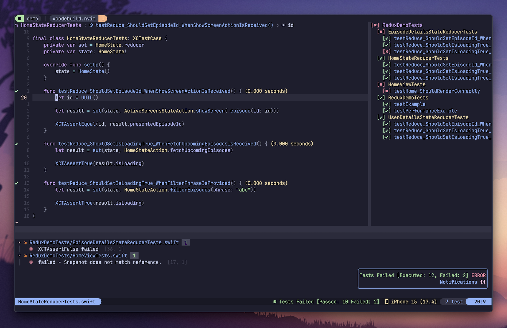

# 🛠️ xcodebuild.nvim

A plugin designed to let you migrate your app development from Xcode to Neovim.
It provides all essential actions for development including building, debugging, and testing.

&nbsp;

## ✨  Features

- [x] Support for iOS, iPadOS, watchOS, tvOS, visionOS, and macOS.
- [x] Support for Swift Packages (building & testing).
- [x] Project-based configuration.
- [x] Project Manager to deal with project files without using Xcode.
- [x] Assets Manager to manage images, colors, and data assets.
- [x] Test Explorer to visually present a tree with all tests and results.
- [x] Built using official command line tools like `xcodebuild` and `xcrun simctl`.
- [x] Actions to build, run, debug, and test apps on simulators and physical devices.
- [x] Previews for SwiftUI, UIKit, and AppKit views.
- [x] Environment variables and run arguments management.
- [x] Buffer integration with test results (code coverage, success & failure marks, duration,
      extra diagnostics).
- [x] Code coverage report with customizable levels.
- [x] Advanced log parser to detect all errors, warnings, and failing tests.
- [x] [nvim-tree], [neo-tree], and [oil.nvim] integration that automatically reflects
      all file tree operations and updates Xcode project.
- [x] [nvim-dap] integration to let you easily build, run, and debug apps.
- [x] [nvim-dap-ui] integration to show app logs in the console window.
- [x] [lualine.nvim] integration to show selected device, test plan, and other project settings.
- [x] [swift-snapshot-testing] integration to present diff views for failing snapshot tests.
- [x] [Quick] integration to show test results for tests written using [Quick] framework.
- [x] [Swift Testing] integration to show test results for tests written using [Swift Testing] framework.
- [x] Auto-detection of the target membership for new files.
- [x] Picker with all available plugin actions.
- [x] Highly customizable (many config options, auto commands, highlights, and user commands).

## 📦  Installation

Read [Wiki] to learn how to install and configure the plugin.

## 📚  Documentation

Everything about the plugin is described in the [Wiki]. You can find there all available commands,
integrations, settings, and examples.

## 🎥  Demo

### Testing

xcodebuild.nvim supports code coverage, test explorer, diagnostics, snapshot tests, Quick framework, and more!

https://github.com/user-attachments/assets/50f8848e-e90b-4b0b-a0ee-79e836982f12

### Working With Code

Neovim can be easily integrated with SwiftLint, SwiftFormat, Copilot, and more.
In the video, you can see basic navigation, diagnostics, formatting, linting, code completion, and of course,
launching the app on a simulator.

https://github.com/user-attachments/assets/67b844f8-c1bd-453d-be64-0592b904e3c2

### Debugging

The plugin allows you to debug both on simulators and physical devices. You get access to all basic things like breakpoints,
variables inspection, call stack, lldb, etc. You can even see app logs.

https://github.com/user-attachments/assets/27644dcd-ef4e-4471-8ddc-cf1c9d2ca27e

### Previews

The plugin allows you to display previews for SwiftUI, UIKit, and AppKit views.
The setup is quite easy, you just need to install [snacks.nvim] to enable image
support and [xcodebuild-nvim-preview] package to add previews to your project.
See [Wiki](https://github.com/wojciech-kulik/xcodebuild.nvim/wiki/Integrations#-previews)
for more details.

https://github.com/user-attachments/assets/ec6c6e96-667a-40a3-a9d3-a75c9c9cf272

&nbsp;

## 💛  Sponsors

Big thanks to all the sponsors who support this project 🍻!

### Monthly Sponsors

### One Time Sponsors

### Past Monthly Sponsors

&nbsp;

[Wiki]: https://github.com/wojciech-kulik/xcodebuild.nvim/wiki
[nvim-tree]: https://github.com/nvim-tree/nvim-tree.lua
[neo-tree]: https://github.com/nvim-neo-tree/neo-tree.nvim
[oil.nvim]: https://github.com/stevearc/oil.nvim
[nvim-dap]: https://github.com/mfussenegger/nvim-dap
[nvim-dap-ui]: https://github.com/rcarriga/nvim-dap-ui
[nvim-treesitter]: https://github.com/nvim-treesitter/nvim-treesitter
[swift-snapshot-testing]: https://github.com/pointfreeco/swift-snapshot-testing
[Quick]: https://github.com/Quick/Quick
[lualine.nvim]: https://github.com/nvim-lualine/lualine.nvim
[Swift Testing]: https://developer.apple.com/xcode/swift-testing/
[snacks.nvim]: https://github.com/folke/snacks.nvim
[xcodebuild-nvim-preview]: https://github.com/wojciech-kulik/xcodebuild-nvim-preview
