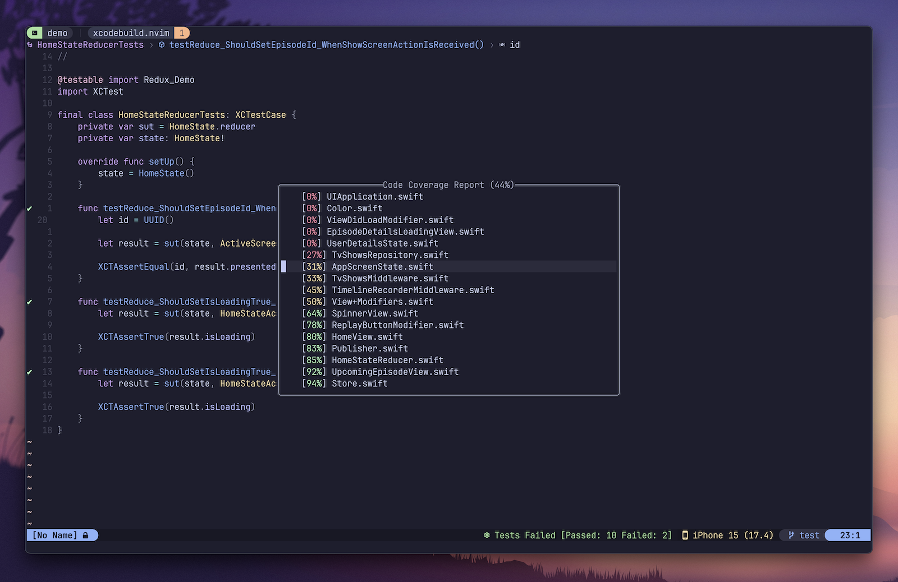

# 🛠️ xcodebuild.nvim

A plugin designed to let you migrate your iOS, iPadOS, and macOS app development to Neovim. It provides all essential actions for development, including building, launching, and testing.


&nbsp;

## ✨ Features

- [x] Support for iOS, iPadOS, and macOS apps built using Swift.
- [x] Project-based configuration.
- [x] Project Manager to deal with project files without using Xcode.
- [x] Test Explorer to visually present a tree with all tests and results.
- [x] Built using official command line tools like `xcodebuild` and `xcrun simctl`.
- [x] Actions to build, run, debug, and test apps on simulators and physical devices.
- [x] Buffer integration with test results (code coverage, success & failure marks, duration, extra diagnostics).
- [x] Code coverage report with customizable levels.
- [x] Browser of failing snapshot tests with a diff preview (if you use [swift-snapshot-testing](https://github.com/pointfreeco/swift-snapshot-testing)).
- [x] Advanced log parser to detect all errors, warnings, and failing tests.
- [x] [nvim-tree](https://github.com/nvim-tree/nvim-tree.lua) integration that automatically reflects all file tree operations and updates Xcode project file.
- [x] [nvim-dap](https://github.com/mfussenegger/nvim-dap) helper functions to let you easily build, run, and debug apps.
- [x] [nvim-dap-ui](https://github.com/rcarriga/nvim-dap-ui) integration with console window to show app logs.
- [x] [lualine.nvim](https://github.com/nvim-lualine/lualine.nvim) integration to show selected device, test plan, and other project settings.
- [x] Picker with all available actions.
- [x] Highly customizable (many config options, auto commands, highlights, and user commands).

&nbsp;

## 🌳 Nvim-tree Integration

Xcodebuild.nvim is integrated with [nvim-tree](https://github.com/nvim-tree/nvim-tree.lua) to let you manage your project and files in a convenient way.

Every change in the file tree presented by [nvim-tree](https://github.com/nvim-tree/nvim-tree.lua) will be automatically reflected in the Xcode project.

https://github.com/wojciech-kulik/xcodebuild.nvim/assets/3128467/ed7d2d2e-eaa4-44ea-a1e6-0027ace4fb97

&nbsp;

## ⚡️ Requirements

##### Neovim environment

- [Neovim 0.9.5+](https://neovim.io)
- [telescope.nvim](https://github.com/nvim-telescope/telescope.nvim) to present pickers.
- [nui.nvim](https://github.com/MunifTanjim/nui.nvim) to present floating code coverage report.
- [nvim-tree](https://github.com/nvim-tree/nvim-tree.lua) to visually manage your project files.
- [nvim-dap](https://github.com/mfussenegger/nvim-dap) and [nvim-dap-ui](https://github.com/rcarriga/nvim-dap-ui) to debug apps.

##### External tools

- [xcbeautify](https://github.com/tuist/xcbeautify) to format Xcode logs (you can set a different tool or disable formatting in the config).
- [Xcodeproj](https://github.com/CocoaPods/Xcodeproj) to manage project files within Neovim.
- [Ruby](https://www.ruby-lang.org) to use `xcodeproj` gem.
- [pymobiledevice3](https://github.com/doronz88/pymobiledevice3) to debug on physical devices and/or run apps on devices below iOS 17.
- [xcode-build-server](https://github.com/SolaWing/xcode-build-server) to make LSP work properly with xcodeproj/xcworkspace.
- [codelldb](https://github.com/vadimcn/codelldb) to debug iOS and macOS Swift apps.
- [Xcode](https://developer.apple.com/xcode/) to build, run, and test apps. Make sure that `xcodebuild` and `xcrun simctl` work correctly. Tested with Xcode 15.

##### Availability of features

|             | Device (iOS <17) | Device (iOS 17+) | via Network (<17 / 17+) | Simulator | MacOS |
| :---------: | :--------------: | :--------------: | :---------------------: | :-------: | :---: |
|    build    |        🛠️        |        ✅        |         ❌ / ✅         |    ✅     |  ✅   |
| (un)install |        🛠️        |        ✅        |         🛠️ / ✅         |    ✅     |  ❌   |
|   launch    |        🛠️        |        ✅        |         🛠️ / ✅         |    ✅     |  ✅   |
|  run tests  |        🛠️        |        ✅        |         ❌ / ✅         |    ✅     |  ✅   |
|    debug    |        🛠️        |      🔐 🛠️       |           ❌            |    ✅     |  ✅   |
| debug tests |        ❌        |        ❌        |           ❌            |    ✅     |  ✅   |
|  app logs   |        🪲        |        🪲        |           ❌            |    ✅     |  🪲   |

🔐 - requires passwordless `sudo` permission for `tools/remote_debugger` script (see below).

🛠️ - available if [pymobiledevice3](https://github.com/doronz88/pymobiledevice3) is installed.

🪲 - available while debugging.

&nbsp;

## 📦 Installation

Install the plugin using your preferred package manager.

### 💤 [lazy.nvim](https://github.com/folke/lazy.nvim)

```lua
return {
  "wojciech-kulik/xcodebuild.nvim",
  dependencies = {
    "nvim-telescope/telescope.nvim",
    "MunifTanjim/nui.nvim",
    "nvim-tree/nvim-tree.lua", -- if you want the integration with file tree
  },
  config = function()
    require("xcodebuild").setup({
        -- put some options here or leave it empty to use default settings
    })
  end,
}
```

Install external tools:

```shell
brew install xcode-build-server
brew install xcbeautify
brew install ruby
gem install xcodeproj
python3 -m pip install -U pymobiledevice3
```

To quickly install all required tools you can run:

```shell
make install
```

> [!TIP]
> Make sure to check out [Tips & Tricks](https://github.com/wojciech-kulik/xcodebuild.nvim/discussions/categories/tips-tricks)!
>
> You will find there a collection of useful tips & tricks for iOS/macOS development in Neovim.

&nbsp;

## 📱 Setup Neovim For iOS Development

I wrote an article that gathers all the steps required to set up Neovim from scratch to develop iOS and macOS apps:

[The Complete Guide To iOS & macOS Development In Neovim](https://wojciechkulik.pl/ios/the-complete-guide-to-ios-macos-development-in-neovim)

You can also check out the sample Neovim configuration that I prepared for iOS development: [ios-dev-starter-nvim](https://github.com/wojciech-kulik/ios-dev-starter-nvim)

&nbsp;

## 🚀 Usage

Make sure to open your project's root directory and run `XcodebuildSetup` to configure it. The plugin needs several information like project file, scheme, config, device, and test plan to be able to run commands.

Remember, that all the information are available in the help `:h xcodebuild`.
Every function is documented and described both in the help and in the code.

### 🔧 Commands

<details>
  <summary>👉 See all user commands</summary>

Xcodebuild.nvim comes with the following commands:

### General

| Command                      | Description                                              |
| ---------------------------- | -------------------------------------------------------- |
| `XcodebuildSetup`            | Run configuration wizard to select project configuration |
| `XcodebuildPicker`           | Show picker with all available actions                   |
| `XcodebuildBuild`            | Build project                                            |
| `XcodebuildCleanBuild`       | Build project (clean build)                              |
| `XcodebuildBuildRun`         | Build & run app                                          |
| `XcodebuildBuildForTesting`  | Build for testing                                        |
| `XcodebuildRun`              | Run app without building                                 |
| `XcodebuildCancel`           | Cancel currently running action                          |
| `XcodebuildCleanDerivedData` | Deletes project's DerivedData                            |
| `XcodebuildToggleLogs`       | Toggle logs panel                                        |
| `XcodebuildOpenLogs`         | Open logs panel                                          |
| `XcodebuildCloseLogs`        | Close logs panel                                         |
| `XcodebuildOpenInXcode`      | Open project in Xcode                                    |
| `XcodebuildQuickfixLine`     | Try fixing issues in the current line                    |
| `XcodebuildCodeActions`      | Show code actions for the current line                   |

### Project Manager

| Command                              | Description                                                |
| ------------------------------------ | ---------------------------------------------------------- |
| `XcodebuildProjectManager`           | Show picker with all Project Manager actions               |
| `XcodebuildCreateNewFile`            | Create a new file and add it to target(s)                  |
| `XcodebuildAddCurrentFile`           | Add the active file to target(s)                           |
| `XcodebuildRenameCurrentFile`        | Rename the current file                                    |
| `XcodebuildDeleteCurrentFile`        | Delete the current file                                    |
| `XcodebuildCreateNewGroup`           | Create a new directory and add it to the project           |
| `XcodebuildAddCurrentGroup`          | Add the parent directory of the active file to the project |
| `XcodebuildRenameCurrentGroup`       | Rename the current directory                               |
| `XcodebuildDeleteCurrentGroup`       | Delete the current directory including all files inside    |
| `XcodebuildUpdateCurrentFileTargets` | Update target membership of the active file                |
| `XcodebuildShowCurrentFileTargets`   | Show target membership of the active file                  |

👉 To add a file to multiple targets use multi-select feature (by default `tab`).

### Testing

| Command                      | Description                               |
| ---------------------------- | ----------------------------------------- |
| `XcodebuildTest`             | Run tests (whole test plan)               |
| `XcodebuildTestTarget`       | Run test target (where the cursor is)     |
| `XcodebuildTestClass`        | Run test class (where the cursor is)      |
| `XcodebuildTestFunc`         | Run test (where the cursor is)            |
| `XcodebuildTestSelected`     | Run selected tests (using visual mode)    |
| `XcodebuildTestFailing`      | Rerun previously failed tests             |
| `XcodebuildFailingSnapshots` | Show a picker with failing snapshot tests |

### Code Coverage

| Command                            | Description                                |
| ---------------------------------- | ------------------------------------------ |
| `XcodebuildToggleCodeCoverage`     | Toggle code coverage marks on the side bar |
| `XcodebuildShowCodeCoverageReport` | Open HTML code coverage report             |
| `XcodebuildJumpToNextCoverage`     | Jump to next code coverage mark            |
| `XcodebuildJumpToPrevCoverage`     | Jump to previous code coverage mark        |

### Test Explorer

| Command                                  | Description                    |
| ---------------------------------------- | ------------------------------ |
| `XcodebuildTestExplorerShow`             | Show Test Explorer             |
| `XcodebuildTestExplorerHide`             | Hide Test Explorer             |
| `XcodebuildTestExplorerToggle`           | Toggle Test Explorer           |
| `XcodebuildTestExplorerRunSelectedTests` | Run Selected Tests             |
| `XcodebuildTestExplorerRerunTests`       | Re-run recently selected tests |

### Configuration

| Command                    | Description                         |
| -------------------------- | ----------------------------------- |
| `XcodebuildSelectProject`  | Show project file picker            |
| `XcodebuildSelectScheme`   | Show scheme picker                  |
| `XcodebuildSelectDevice`   | Show device picker                  |
| `XcodebuildSelectTestPlan` | Show test plan picker               |
| `XcodebuildShowConfig`     | Print current project configuration |
| `XcodebuildBootSimulator`  | Boot selected simulator             |
| `XcodebuildInstallApp`     | Install application                 |
| `XcodebuildUninstallApp`   | Uninstall application               |

</details>

### ⌘ Sample Key Bindings

```lua
vim.keymap.set("n", "<leader>X", "<cmd>XcodebuildPicker<cr>", { desc = "Show Xcodebuild Actions" })
vim.keymap.set("n", "<leader>xf", "<cmd>XcodebuildProjectManager<cr>", { desc = "Show Project Manager Actions" })

vim.keymap.set("n", "<leader>xb", "<cmd>XcodebuildBuild<cr>", { desc = "Build Project" })
vim.keymap.set("n", "<leader>xB", "<cmd>XcodebuildBuildForTesting<cr>", { desc = "Build For Testing" })
vim.keymap.set("n", "<leader>xr", "<cmd>XcodebuildBuildRun<cr>", { desc = "Build & Run Project" })

vim.keymap.set("n", "<leader>xt", "<cmd>XcodebuildTest<cr>", { desc = "Run Tests" })
vim.keymap.set("v", "<leader>xt", "<cmd>XcodebuildTestSelected<cr>", { desc = "Run Selected Tests" })
vim.keymap.set("n", "<leader>xT", "<cmd>XcodebuildTestClass<cr>", { desc = "Run This Test Class" })

vim.keymap.set("n", "<leader>xl", "<cmd>XcodebuildToggleLogs<cr>", { desc = "Toggle Xcodebuild Logs" })
vim.keymap.set("n", "<leader>xc", "<cmd>XcodebuildToggleCodeCoverage<cr>", { desc = "Toggle Code Coverage" })
vim.keymap.set("n", "<leader>xC", "<cmd>XcodebuildShowCodeCoverageReport<cr>", { desc = "Show Code Coverage Report" })
vim.keymap.set("n", "<leader>xe", "<cmd>XcodebuildTestExplorerToggle<cr>", { desc = "Toggle Test Explorer" })
vim.keymap.set("n", "<leader>xs", "<cmd>XcodebuildFailingSnapshots<cr>", { desc = "Show Failing Snapshots" })

vim.keymap.set("n", "<leader>xd", "<cmd>XcodebuildSelectDevice<cr>", { desc = "Select Device" })
vim.keymap.set("n", "<leader>xp", "<cmd>XcodebuildSelectTestPlan<cr>", { desc = "Select Test Plan" })
vim.keymap.set("n", "<leader>xq", "<cmd>Telescope quickfix<cr>", { desc = "Show QuickFix List" })

vim.keymap.set("n", "<leader>xx", "<cmd>XcodebuildQuickfixLine<cr>", { desc = "Quickfix Line" })
vim.keymap.set("n", "<leader>xa", "<cmd>XcodebuildCodeActions<cr>", { desc = "Show Code Actions" })
```

> [!TIP]
> Press `<leader>X` to access the picker with all commands.
>
> Press `<leader>xf` to access the picker with all Project Manager commands.
>
> Press `<C-r>` when the picker with devices is presented to refresh the list.

### 📋 Logs Panel

- Press `o` on a failed test in the summary section to jump to the failing location
- Press `q` to close the panel

### 🧪 Test Explorer

- Press `o` to jump to the test implementation
- Press `t` to run selected tests
- Press `T` to re-run recently selected tests
- Press `R` to reload test list
- Press `[` to jump to the previous failed test
- Press `]` to jump to the next failed test
- Press `<cr>` to expand or collapse the current node
- Press `<tab>` to expand or collapse all classes
- Press `q` to close the Test Explorer

&nbsp;

## ⚙️ Configuration

### 🔥 Customize Xcodebuild.nvim

<details>
  <summary>See default Xcodebuild.nvim config</summary>

```lua
{
  restore_on_start = true, -- logs, diagnostics, and marks will be loaded on VimEnter (may affect performance)
  auto_save = true, -- save all buffers before running build or tests (command: silent wa!)
  show_build_progress_bar = true, -- shows [ ...    ] progress bar during build, based on the last duration
  prepare_snapshot_test_previews = true, -- prepares a list with failing snapshot tests
  test_search = {
    file_matching = "filename_lsp", -- one of: filename, lsp, lsp_filename, filename_lsp. Check out README for details
    target_matching = true, -- checks if the test file target matches the one from logs. Try disabling it in case of not showing test results
    lsp_client = "sourcekit", -- name of your LSP for Swift files
    lsp_timeout = 200, -- LSP timeout in milliseconds
  },
  commands = {
    cache_devices = true, -- cache recently loaded devices. Restart Neovim to clean cache.
    extra_build_args = "-parallelizeTargets", -- extra arguments for `xcodebuild build`
    extra_test_args = "-parallelizeTargets", -- extra arguments for `xcodebuild test`
    project_search_max_depth = 3, -- maxdepth of xcodeproj/xcworkspace search while using configuration wizard
    remote_debugger = nil, -- optional path to local copy of remote_debugger (check out README for details)
    remote_debugger_port = 65123, -- port used by remote debugger (passed to pymobiledevice3)
  },
  logs = { -- build & test logs
    auto_open_on_success_tests = false, -- open logs when tests succeeded
    auto_open_on_failed_tests = false, -- open logs when tests failed
    auto_open_on_success_build = false, -- open logs when build succeeded
    auto_open_on_failed_build = true, -- open logs when build failed
    auto_close_on_app_launch = false, -- close logs when app is launched
    auto_close_on_success_build = false, -- close logs when build succeeded (only if auto_open_on_success_build=false)
    auto_focus = true, -- focus logs buffer when opened
    filetype = "objc", -- file type set for buffer with logs
    open_command = "silent botright 20split {path}", -- command used to open logs panel. You must use {path} variable to load the log file
    logs_formatter = "xcbeautify --disable-colored-output", -- command used to format logs, you can use "" to skip formatting
    only_summary = false, -- if true logs won't be displayed, just xcodebuild.nvim summary
    show_warnings = true, -- show warnings in logs summary
    notify = function(message, severity) -- function to show notifications from this module (like "Build Failed")
      vim.notify(message, severity)
    end,
    notify_progress = function(message) -- function to show live progress (like during tests)
      vim.cmd("echo '" .. message .. "'")
    end,
  },
  console_logs = {
    enabled = true, -- enable console logs in dap-ui
    format_line = function(line) -- format each line of logs
      return line
    end,
    filter_line = function(line) -- filter each line of logs
      return true
    end,
  },
  marks = {
    show_signs = true, -- show each test result on the side bar
    success_sign = "✔", -- passed test icon
    failure_sign = "✖", -- failed test icon
    show_test_duration = true, -- show each test duration next to its declaration
    show_diagnostics = true, -- add test failures to diagnostics
    file_pattern = "*Tests.swift", -- test diagnostics will be loaded in files matching this pattern (if available)
  },
  quickfix = {
    show_errors_on_quickfixlist = true, -- add build/test errors to quickfix list
    show_warnings_on_quickfixlist = true, -- add build warnings to quickfix list
  },
  test_explorer = {
    enabled = true, -- enable Test Explorer
    auto_open = true, -- open Test Explorer when tests are started
    auto_focus = true, -- focus Test Explorer when opened
    open_command = "botright 42vsplit Test Explorer", -- command used to open Test Explorer, must create a buffer with "Test Explorer" name
    open_expanded = true, -- open Test Explorer with expanded classes
    success_sign = "✔", -- passed test icon
    failure_sign = "✖", -- failed test icon
    progress_sign = "…", -- progress icon (only used when animate_status=false)
    disabled_sign = "⏸", -- disabled test icon
    partial_execution_sign = "‐", -- icon for a class or target when only some tests were executed
    not_executed_sign = " ", -- not executed or partially executed test icon
    show_disabled_tests = false, -- show disabled tests
    animate_status = true, -- animate status while running tests
    cursor_follows_tests = true, -- moves cursor to the last test executed
  },
  code_coverage = {
    enabled = false, -- generate code coverage report and show marks
    file_pattern = "*.swift", -- coverage will be shown in files matching this pattern
    -- configuration of line coverage presentation:
    covered_sign = "",
    partially_covered_sign = "┃",
    not_covered_sign = "┃",
    not_executable_sign = "",
  },
  code_coverage_report = {
    warning_coverage_level = 60,
    error_coverage_level = 30,
    open_expanded = false,
  },
  integrations = {
    xcode_build_server = {
      enabled = false, -- run "xcode-build-server config" when scheme changes
    },
    nvim_tree = {
      enabled = true, -- enable updating Xcode project files when using nvim-tree
      should_update_project = function(path) -- path can lead to directory or file
        -- it could be useful if you mix Xcode project with SPM for example
        return true
      end,
    },
  },
  highlights = {
    -- you can override here any highlight group used by this plugin
    -- simple color: XcodebuildCoverageReportOk = "#00ff00",
    -- link highlights: XcodebuildCoverageReportOk = "DiagnosticOk",
    -- full customization: XcodebuildCoverageReportOk = { fg = "#00ff00", bold = true },
  },
}
```

</details>

### 🎨 Customize Highlights

<details>
  <summary>See all highlights</summary>

#### Test File

| Highlight Group                     | Description                    |
| ----------------------------------- | ------------------------------ |
| `XcodebuildTestSuccessSign`         | Test passed sign               |
| `XcodebuildTestFailureSign`         | Test failed sign               |
| `XcodebuildTestSuccessDurationSign` | Test duration of a passed test |
| `XcodebuildTestFailureDurationSign` | Test duration of a failed test |

#### Test Explorer

| Highlight Group                              | Description                 |
| -------------------------------------------- | --------------------------- |
| `XcodebuildTestExplorerTest`                 | Test name (function)        |
| `XcodebuildTestExplorerClass`                | Test class                  |
| `XcodebuildTestExplorerTarget`               | Test target                 |
| `XcodebuildTestExplorerTestInProgress`       | Test in progress sign       |
| `XcodebuildTestExplorerTestPassed`           | Test passed sign            |
| `XcodebuildTestExplorerTestFailed`           | Test failed sign            |
| `XcodebuildTestExplorerTestDisabled`         | Test disabled sign          |
| `XcodebuildTestExplorerTestNotExecuted`      | Test not executed sign      |
| `XcodebuildTestExplorerTestPartialExecution` | Not all tests executed sign |

#### Code Coverage (inline)

| Highlight Group                         | Description                          |
| --------------------------------------- | ------------------------------------ |
| `XcodebuildCoverageFullSign`            | Covered line - sign                  |
| `XcodebuildCoverageFullNumber`          | Covered line - line number           |
| `XcodebuildCoverageFullLine`            | Covered line - code                  |
| `XcodebuildCoveragePartialSign`         | Partially covered line - sign        |
| `XcodebuildCoveragePartialNumber`       | Partially covered line - line number |
| `XcodebuildCoveragePartialLine`         | Partially covered line - code        |
| `XcodebuildCoverageNoneSign`            | Not covered line - sign              |
| `XcodebuildCoverageNoneNumber`          | Not covered line - line number       |
| `XcodebuildCoverageNoneLine`            | Not covered line - code              |
| `XcodebuildCoverageNotExecutableSign`   | Not executable line - sign           |
| `XcodebuildCoverageNotExecutableNumber` | Not executable line - line number    |
| `XcodebuildCoverageNotExecutableLine`   | Not executable line - code           |

#### Code Coverage (report)

| Highlight Group                   | Description                                          |
| --------------------------------- | ---------------------------------------------------- |
| `XcodebuildCoverageReportOk`      | Percentage color when above `warning_coverage_level` |
| `XcodebuildCoverageReportWarning` | Percentage color when below `warning_coverage_level` |
| `XcodebuildCoverageReportError`   | Percentage color when below `error_coverage_level`   |

</details>

### 🤖 Customize Behaviors

<details>
  <summary>See all auto commands</summary>

You can customize integration with xcodebuild.nvim plugin by subscribing to notifications.

Example:

```lua
vim.api.nvim_create_autocmd("User", {
  pattern = "XcodebuildTestsFinished",
  callback = function(event)
    print("Tests finished (passed: "
        .. event.data.passedCount
        .. ", failed: "
        .. event.data.failedCount
        .. ")"
    )
  end,
})
```

Use `print(vim.inspect(event.data))` to see what is exactly provided in the payload.

Below you can find a list of all available auto commands.

| Pattern                            | Provided Data (`event.data`)                                                       |
| ---------------------------------- | ---------------------------------------------------------------------------------- |
| `XcodebuildBuildStarted`           | `forTesting (Bool)`                                                                |
| `XcodebuildBuildStatus`            | `forTesting (Bool), progress (Int? [0-100]), duration (Int)`                       |
| `XcodebuildBuildFinished`          | `forTesting (Bool), success (Bool), cancelled (Bool), errors (ParsedBuildError[])` |
| `XcodebuildTestsStarted`           | none                                                                               |
| `XcodebuildTestsStatus`            | `passedCount (Int), failedCount (Int)`                                             |
| `XcodebuildTestsFinished`          | `passedCount (Int), failedCount (Int), cancelled (Bool)`                           |
| `XcodebuildApplicationLaunched`    | none                                                                               |
| `XcodebuildActionCancelled`        | none                                                                               |
| `XcodebuildProjectSettingsUpdated` | `(ProjectSettings)`                                                                |
| `XcodebuildTestExplorerToggled`    | `visible (Bool), bufnr (Int?), winnr (Int?)`                                       |
| `XcodebuildCoverageToggled`        | `(Bool)`                                                                           |
| `XcodebuildCoverageReportToggled`  | `visible (Bool), bufnr (Int?), winnr (Int?)`                                       |
| `XcodebuildLogsToggled`            | `visible (Bool), bufnr (Int?), winnr (Int?)`                                       |

</details>

### 📦 Swift Packages Development

This plugin supports only iOS and macOS applications. However, if you develop Swift Package for one of those platforms, you can easily use this plugin by creating a sample iOS/macOS project in your root directory and by adding your package as a dependency.

&nbsp;

## 🔬 Debugger Configuration

[nvim-dap](https://github.com/mfussenegger/nvim-dap) plugin lets you debug applications like in any other IDE. On top of that [nvim-dap-ui](https://github.com/rcarriga/nvim-dap-ui) extension will present for you all panels with stack, breakpoints, variables, logs, etc.

To configure DAP for development:

- Download codelldb VS Code plugin from: [HERE](https://github.com/vadimcn/codelldb/releases). For macOS use `darwin` version. Just unzip `vsix` file and set paths below.
- Install also [nvim-dap-ui](https://github.com/rcarriga/nvim-dap-ui) for a nice GUI to debug.
- Make sure to enable `console` window from `nvim-dap-ui` to see simulator logs.

```lua
return {
  "mfussenegger/nvim-dap",
  dependencies = {
    "wojciech-kulik/xcodebuild.nvim"
  },
  config = function()
    local xcodebuild = require("xcodebuild.integrations.dap")
    -- SAMPLE PATH, change it to your local codelldb path
    local codelldbPath = os.getenv("HOME") .. "/tools/codelldb-aarch64-darwin/extension/adapter/codelldb"

    xcodebuild.setup(codelldbPath)

    vim.keymap.set("n", "<leader>dd", xcodebuild.build_and_debug, { desc = "Build & Debug" })
    vim.keymap.set("n", "<leader>dr", xcodebuild.debug_without_build, { desc = "Debug Without Building" })
    vim.keymap.set("n", "<leader>dt", xcodebuild.debug_tests, { desc = "Debug Tests" })
    vim.keymap.set("n", "<leader>dT", xcodebuild.debug_class_tests, { desc = "Debug Class Tests" })
    vim.keymap.set("n", "<leader>b", xcodebuild.toggle_breakpoint, { desc = "Toggle Breakpoint" })
    vim.keymap.set("n", "<leader>B", xcodebuild.toggle_message_breakpoint, { desc = "Toggle Message Breakpoint" })
    vim.keymap.set("n", "<leader>dx", xcodebuild.terminate_session, { desc = "Terminate Debugger" })
  end,
}
```

&nbsp;

## 📲 Debugging On iOS 17+ Device

Since iOS 17, a new secure connection between Mac and mobile devices is required. Xcodebuild.nvim uses [pymobiledevice3](https://github.com/doronz88/pymobiledevice3)
to establish a special trusted tunnel that is later used for debugging. However, this operation requires `sudo`
([more details](https://github.com/doronz88/pymobiledevice3/blob/master/misc/RemoteXPC.md#trusted-tunnel)).

Showing a pop-up to enter a password every time you run a debugger would be quite annoying. That's why the plugin provides a small script ([tools/remote_debugger](./tools/remote_debugger))
that wraps the only two operations requiring `sudo` (starting a secure tunnel and closing it).

This allows you to configure passwordless access just for this single file and make it work with xcodebuild.nvim. You can even make a local copy if you are worried that the content of
this file could be changed in the future.

#### Passwordless access to `remote_debugger`

You can disable password requirement by updating `/etc/sudoers` file. Make sure to use the command below, otherwise you may break your `sudo` command:

```shell
sudo visudo -f /etc/sudoers
```

Append this line, but first update the path and the username:

```
YOUR_USERNAME ALL = (ALL) NOPASSWD: /Users/YOUR_USERNAME/.local/share/nvim/lazy/xcodebuild.nvim/tools/remote_debugger
```

#### Creating a local copy of `remote_debugger`

If you don't want to configure the passwordless permission to the file that could be changed in the future, you can make a local copy of this script,
set your local path in the config `commands.remote_debugger`, and update `/etc/sudoers` accordingly.

**Please remember that you will have to update this file manually if it changes in the future.**

&nbsp;

## 🐛 Application Logs

If you installed [nvim-dap](https://github.com/mfussenegger/nvim-dap) and [nvim-dap-ui](https://github.com/rcarriga/nvim-dap-ui), you can easily track your app logs. The plugin automatically sends logs to the `console` window provided by [nvim-dap-ui](https://github.com/rcarriga/nvim-dap-ui).

To see **SIMULATOR** logs you don't need to run the debugger. You can just show the `console` and run the app (remember that the app must be launched using xcodebuild.nvim).

```
:lua require("dapui").toggle()
```

> [!IMPORTANT]
> Logs printed by `NSLog` will appear only if the debugger is NOT attached.

You can always clear the console window by calling:

```
:lua require("xcodebuild.integrations.dap").clear_console()
```

#### Logs without using nvim-dap

If you don't want to use [nvim-dap](https://github.com/mfussenegger/nvim-dap) you can always print logs directly to your terminal by calling (from your root directory):

```bash
tail -f .nvim/xcodebuild/app_logs.log
```

This approach works especially well if you are using tmux.

&nbsp;

## 🚥 Lualine Integration

You can also integrate this plugin with [lualine.nvim](https://github.com/nvim-lualine/lualine.nvim).


<details>
    <summary>See Lualine configuration</summary>

```lua
local function xcodebuild_device()
  if vim.g.xcodebuild_platform == "macOS" then
    return " macOS"
  end

  if vim.g.xcodebuild_os then
    return " " .. vim.g.xcodebuild_device_name .. " (" .. vim.g.xcodebuild_os .. ")"
  end

  return " " .. vim.g.xcodebuild_device_name
end

------

lualine_x = {
  { "' ' .. vim.g.xcodebuild_last_status", color = { fg = "Gray" } },
  { "'󰙨 ' .. vim.g.xcodebuild_test_plan", color = { fg = "#a6e3a1", bg = "#161622" } },
  { xcodebuild_device, color = { fg = "#f9e2af", bg = "#161622" } },
},
```

Global variables that you can use:

| Variable                       | Description                                        |
| ------------------------------ | -------------------------------------------------- |
| `vim.g.xcodebuild_device_name` | Device name (ex. iPhone 15 Pro)                    |
| `vim.g.xcodebuild_os`          | OS version (ex. 16.4)                              |
| `vim.g.xcodebuild_platform`    | Device platform (macOS or iPhone Simulator)        |
| `vim.g.xcodebuild_config`      | Selected build config (ex. Debug)                  |
| `vim.g.xcodebuild_scheme`      | Selected project scheme (ex. MyApp)                |
| `vim.g.xcodebuild_test_plan`   | Selected Test Plan (ex. MyAppTests)                |
| `vim.g.xcodebuild_last_status` | Last build/test status (ex. Build Succeeded [15s]) |

</details>

&nbsp;

## 🧪 Code Coverage



<details>
    <summary>See how to configure</summary>
Using xcodebuild.nvim you can also check the code coverage after running tests.

1. Make sure that you enabled code coverage for desired targets in your test plan.
2. Enable code coverage in xcodebuild [config](#%EF%B8%8F-configuration):

```lua
code_coverage = {
  enabled = true,
}
```

3. Toggle code coverage `:XcodebuildToggleCodeCoverage` or `:lua require("xcodebuild.actions").toggle_code_coverage(true)`.
4. Run tests - once they're finished, code coverage should appear on the sidebar with line numbers.
5. You can jump between code coverage marks using `:XcodebuildJumpToPrevCoverage` and `:XcodebuildJumpToNextCoverage`.
6. You can also check out the report using `:XcodebuildShowCodeCoverageReport` command.

The plugin sends `XcodebuildCoverageToggled` event that you can use to disable other plugins presenting lines on the side bar (like `gitsigns`). Example:

```lua
vim.api.nvim_create_autocmd("User", {
  pattern = "XcodebuildCoverageToggled",
  callback = function(event)
    local isOn = event.data
    require("gitsigns").toggle_signs(not isOn)
  end,
})
```

Coverage Report Keys:

| Key              | Description                         |
| ---------------- | ----------------------------------- |
| `enter` or `tab` | Expand or collapse the current node |
| `o`              | Open source file                    |

</details>

&nbsp;

## 📸 Snapshot Tests Preview

This plugin offers a nice list of failing snapshot tests. For each test it generates a preview image combining reference, failure, and difference images into one. It works with [swift-snapshot-testing](https://github.com/pointfreeco/swift-snapshot-testing) library.

Run `:XcodebuildFailingSnapshots` to see the list.


&nbsp;

## 👨‍💻 API

If you want to use functions directly instead of user commands, then please see [xcodebuild.actions](./lua/xcodebuild/actions.lua) module.

&nbsp;

## 🧰 Troubleshooting

> [!IMPORTANT]
> The first thing you should do is to check the output of `:checkhealth xcodebuild` and fix all issues.
>
> Run it from your project root directory.

#### Configuration

Processing the project configuration is a very complex task that relies on parsing multiple crazy outputs from `xcodebuild` commands. Those logs are a pure nightmare to work with. This process may not always work.

In case of any issues with, you can try manually providing the configuration file `.nvim/xcodebuild/settings.json` in your root directory.

<details>
    <summary>See a sample settings.json file</summary>

```json
{
  "bundleId": "com.company.bundle-id",
  "show_coverage": false,
  "deviceName": "iPhone 15",
  "destination": "28B52DAA-BC2F-410B-A5BE-F485A3AFB0BC",
  "config": "Debug",
  "testPlan": "YourTestPlanName",
  "projectFile": "/path/to/project/App.xcodeproj",
  "scheme": "App",
  "platform": "iOS Simulator",
  "productName": "App",
  "projectCommand": "-workspace '/path/to/project/App.xcworkspace'",
  "xcodeproj": "/path/to/project/App.xcodeproj",
  "lastBuildTime": 10,
  "os": "17.2",
  "appPath": "/Users/YOU/Library/Developer/Xcode/DerivedData/App-abafsafasdfasdf/Build/Products/Debug/App.app"
}
```

- `platform` - `macOS` or `iOS Simulator`
- `destination` - simulator ID
- `projectFile` / `projectCommand` - can be `xcodeproj` or `xcworkspace`, the main project file that you use

</details>

#### Tests

If you encounter issues with test detection, you may want to read this: [Test File Search - File Matching](https://github.com/wojciech-kulik/xcodebuild.nvim/discussions/41).

#### LSP

In most cases, it's enough to run the project in Xcode, clean it `CMD+Shift+K`, build again `CMD+B`, and run `xcode-build-server config` again.

#### Useful Help Tags

- `:h xcodebuild`
- `:h xcodebuild.config`
- `:h xcodebuild.keys`
- `:h xcodebuild.tools`
- `:h xcodebuild.commands`
- `:h xcodebuild.highlights`
- `:h xcodebuild.events`
- `:h xcodebuild.project-manager`
- `:h xcodebuild.test-explorer`
- `:h xcodebuild.code-coverage-report`
- `:h xcodebuild.dap`
- `:h xcodebuild.lualine`
- `:h xcodebuild.actions`
