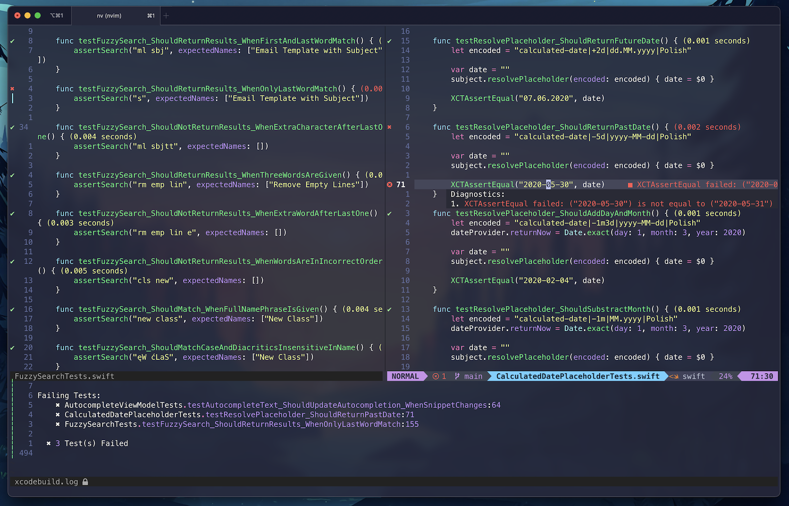
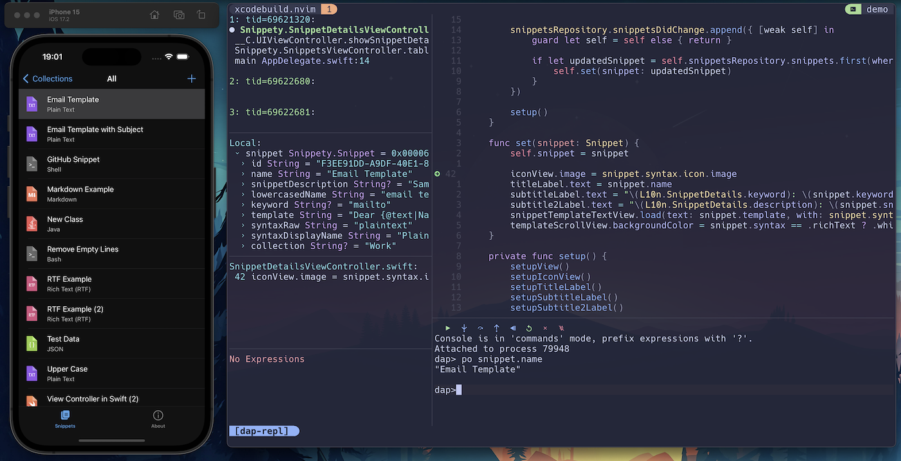
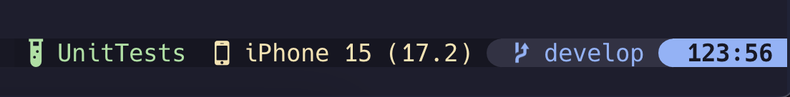
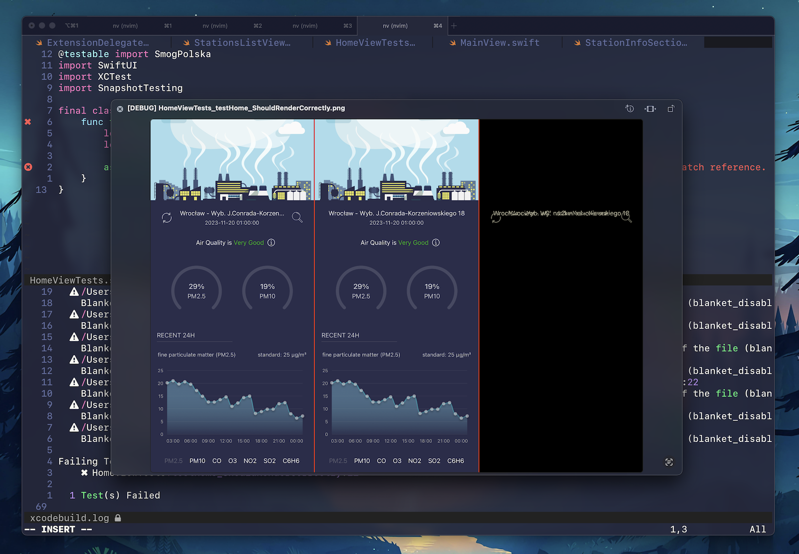

# 🛠️ xcodebuild.nvim

A plugin that lets you move your iOS, iPadOS and macOS apps development to Neovim. It supports most of Xcode actions that are required to work with a project, including device selection, building, launching, and testing.





## 🚧 Disclaimer

This plugin is in the early stage of development. It was tested on a limited number of projects and configurations. Therefore, it still could be buggy. If you find any issue don't hesitate to fix it and create a pull request or just report it.

I've been looking for a solution to move my development to any other IDE than Xcode for a long time. It seems that this plugin + [nvim-dap](https://github.com/mfussenegger/nvim-dap) + [nvim-dap-ui](https://github.com/rcarriga/nvim-dap-ui) + [nvim-lspconfig](https://github.com/neovim/nvim-lspconfig) + [xcode-build-server](https://github.com/SolaWing/xcode-build-server), all together, provide everything that is needed to move to Neovim with iOS, iPadOS, and macOS apps development.

Of course, you will still need Xcode for some project setup & management. Also, you may need to migrate to [tuist](https://github.com/tuist/tuist) or [xcodegen](https://github.com/yonaskolb/XcodeGen) to be able to add new files easily.

It is also my first Neovim plugin. Hopefully, a good one 😁.

## ✨ Features

- [x] Support for iOS, iPadOS, and macOS apps.
- [x] Project-based configuration.
- [x] Configuration wizard to setup: project file, scheme, config, device, and test plan.
- [x] Built based on core command line tools like `xcodebuild` and `xcrun simctl`. It doesn't require any external tools, only `xcbeautify` to format logs, but it could be changed in configuration.
- [x] Build, run and test actions.
- [x] App deployment to selected iOS simulator.
- [x] Uninstall mobile app.
- [x] Running only selected tests (one test, one class, selected tests in visual mode, whole test plan).
- [x] Showing icons with test result next to each test.
- [x] Showing test duration next to each test.
- [x] Showing test errors in diagnostics and on the quickfix list.
- [x] Showing build errors and warnings on the quickfix list.
- [x] Showing build progress bar based on the previous build time.
- [x] Showing preview of failed snapshot tests (if you use [swift-snapshot-testing](https://github.com/pointfreeco/swift-snapshot-testing))
- [x] Advanced log parser to detect all errors, warnings, and failing tests and to present them nicely formatted.
- [x] Auto saving files before build or test actions.
- [x] [nvim-dap](https://github.com/mfussenegger/nvim-dap) helper functions to let you easily build, run, and attach the debugger.
- [x] [lualine.nvim](https://github.com/nvim-lualine/lualine.nvim) integration to show current device and project settings.
- [x] [telescope.nvim](https://github.com/nvim-telescope/telescope.nvim) integration to show pickers with selectable project options.
- [x] Picker with all available actions.

## ⚡️ Requirements

- [Neovim](https://neovim.io) (not sure which version, use the new one :D).
- [xcbeautify](https://github.com/tuist/xcbeautify) tool (`brew install xcbeautify`) or just turn it off in config.
- [telescope.nvim](https://github.com/nvim-telescope/telescope.nvim) to present all pickers by the plugin.
- Xcode (make sure that `xcodebuild` and `xcrun simctl` work correctly).
- To get the best experience with apps development, you should install and configure [nvim-dap](https://github.com/mfussenegger/nvim-dap) and [nvim-dap-ui](https://github.com/rcarriga/nvim-dap-ui) to be able to debug.
- This plugin requires the project to be written in Swift. It was tested only with Xcode 15.
- [lsp-trouble.nvim](https://github.com/simrat39/lsp-trouble.nvim) - if you want to see all issues nicely presented, you can use it with `quickfix` mode.
- Make sure to configure LSP properly for iOS/macOS apps. You can read how to do that in my post: [How to develop iOS and macOS apps in Neovim?](https://wojciechkulik.pl/ios/how-to-develop-ios-and-macos-apps-in-other-ides-like-neovim-or-vs-code).

## 📦 Installation

Install the plugin with your preferred package manager:

### [lazy.nvim](https://github.com/folke/lazy.nvim)

```lua
return {
  "wojciech-kulik/xcodebuild.nvim",
  dependencies = { "nvim-telescope/telescope.nvim" },
  config = function()
    require("xcodebuild").setup({
        -- put some options here or leave it empty to use default settings
    })
  end,
}
```

## ⚙️ Configuration

### Setup

Xcodebuild.nvim comes with the following defaults:

```lua
{
  restore_on_start = true, -- logs, diagnostics, and marks will be loaded on VimEnter (may affect performance)
  auto_save = true, -- save all buffers before running build or tests (command: silent wa!)
  show_build_progress_bar = true, -- shows [ ...    ] progress bar during build, based on the last duration
  prepare_snapshot_test_previews = true, -- prepares a list with failing snapshot tests
  test_search = {
    file_matching = "filename_lsp", -- one of: filename, lsp, lsp_filename, filename_lsp. Check out README for details.
    target_matching = true, -- checks if the test file target matches the one from logs try disabling in case of not showing test results
    lsp_client = "sourcekit", -- name of your LSP for Swift files
    lsp_timeout = 200, -- LSP timeout in milliseconds,
  },
  commands = {
    cache_devices = true, -- cache recently loaded devices. Restart Neovim to clean cache.
    extra_build_args = "-parallelizeTargets", -- extra arguments for `xcodebuild build`
    extra_test_args = "-parallelizeTargets", -- extra arguments for `xcodebuild test`
  },
  logs = {
    auto_open_on_success_tests = true, -- open logs when tests succeeded
    auto_open_on_failed_tests = true, -- open logs when tests failed
    auto_open_on_success_build = true, -- open logs when build succeeded
    auto_open_on_failed_build = true, -- open logs when build failed
    auto_close_on_app_launch = false, -- close logs when app is launched
    auto_close_on_success_build = false, -- close logs when build succeeded (only if auto_open_on_success_build=false)
    auto_focus = true, -- focus logs buffer when opened
    filetype = "objc", -- file type set for buffer with logs
    open_command = "silent bo split {path} | resize 20", -- command used to open logs panel. You must use {path} variable to load the log file
    logs_formatter = "xcbeautify --disable-colored-output", -- command used to format logs, you can use "" to skip formatting
    only_summary = false, -- if true logs won't be displayed, just xcodebuild.nvim summary
    show_warnings = true, -- show warnings in logs summary
    notify = function(message, severity) -- function to show notifications from this module (like "Build Failed")
      vim.notify(message, severity)
    end,
    notify_progress = function(message) -- function to show live progress (like during tests)
      vim.cmd("echo '" .. message .. "'")
    end,
  },
  marks = {
    show_signs = true, -- show each test result on the side bar
    success_sign = "✔", -- passed test icon
    failure_sign = "✖", -- failed test icon
    success_sign_hl = "DiagnosticSignOk", -- highlight for success_sign
    failure_sign_hl = "DiagnosticSignError", -- highlight for failure_sign
    show_test_duration = true, -- show each test duration next to its declaration
    success_test_duration_hl = "DiagnosticWarn", -- test duration highlight when test passed
    failure_test_duration_hl = "DiagnosticError", -- test duration highlight when test failed
    show_diagnostics = true, -- add test failures to diagnostics
    file_pattern = "*Tests.swift", -- test diagnostics will be loaded in files matching this pattern (if available)
  },
  quickfix = {
    show_errors_on_quickfixlist = true, -- add build/test errors to quickfix list
    show_warnings_on_quickfixlist = true, -- add build warnings to quickfix list
  },
}
```

### Test File Search - File Matching

`xcodebuild` logs provide the following information about the test: target, test class, and test name. The plugin needs to find the file location based on that, which is not a trivial task.

In order to support multiple cases, the plugin allows you to choose the search mode. It offers four modes to find a test class. You can change it by setting `test_search.file_matching`.

- `filename` - it assumes that the test class name matches the file name. It finds matching files and then based on the build output, it checks whether the file belongs to the desired target.
- `lsp` - it uses LSP to find the class symbol. Each match is checked if it belongs to the desired target.
- `filename_lsp` first try `filename` mode, if it fails try `lsp` mode.
- `lsp_filename` first try `lsp` mode, if it fails try `filename` mode.

`filename_lsp` is the recommended mode, because `filename` search is faster than `lsp`, but you also have `lsp` fallback if there is no match from `filename`.

👉 If you notice that your test results don't appear or appear in incorrect files, try playing with these modes.

👉 If your test results don't appear, you can also try disabling `test_search.target_matching`. This way the plugin will always use the first match without checking its target. Target-file list comes from the build output and in some cases you may need to disable it.

### Setup Your Neovim For iOS Development

I wrote an article that sums up all steps to set up your Neovim from scratch to develop iOS and macOS apps:

[The Complete Guide To iOS & macOS Development In Neovim](https://wojciechkulik.pl/ios/the-complete-guide-to-ios-macos-development-in-neovim)

You can also check out a sample Neovim configuration that I prepared for iOS development: [ios-dev-starter-nvim](https://github.com/wojciech-kulik/ios-dev-starter-nvim)

### Swift Packages Development

This plugin supports only iOS and macOS applications. However, if you develop Swift Package for one of those platforms, you can easily use this plugin by creating a sample iOS/macOS project in your root directory and adding your package as a dependency.

### DAP Integration

[nvim-dap](https://github.com/mfussenegger/nvim-dap) plugin lets you debug applications like in any other IDE. On top of that [nvim-dap-ui](https://github.com/rcarriga/nvim-dap-ui) extension will present for you all panels with stack, breakpoints, variables, logs, etc.

To configure DAP for development:

- Download codelldb VS Code plugin from: [HERE](https://github.com/vadimcn/codelldb/releases). For macOS use `darwin` version. Just unzip `vsix` file and set paths below.
- Install also [nvim-dap-ui](https://github.com/rcarriga/nvim-dap-ui) for a nice GUI to debug.

```lua
return {
  "mfussenegger/nvim-dap",
  dependencies = {
    "wojciech-kulik/xcodebuild.nvim"
  },
  config = function()
    local dap = require("dap")
    local xcodebuild = require("xcodebuild.dap")

    dap.configurations.swift = {
      {
        name = "iOS App Debugger",
        type = "codelldb",
        request = "attach",
        program = xcodebuild.get_program_path,
        -- alternatively, you can wait for the process manually
        -- pid = xcodebuild.wait_for_pid,
        cwd = "${workspaceFolder}",
        stopOnEntry = false,
        waitFor = true,
      },
    }

    dap.adapters.codelldb = {
      type = "server",
      port = "13000",
      executable = {
        -- set path to the downloaded codelldb
        -- sample path: "/Users/YOU/Downloads/codelldb-aarch64-darwin/extension/adapter/codelldb"
        command = "/path/to/codelldb/extension/adapter/codelldb",
        args = {
          "--port",
          "13000",
          "--liblldb",
          -- make sure that this path is correct on your side
          "/Applications/Xcode.app/Contents/SharedFrameworks/LLDB.framework/Versions/A/LLDB",
        },
      },
    }

    -- sample keymaps to debug application
    vim.keymap.set("n", "<leader>dd", xcodebuild.build_and_debug, { desc = "Build & Debug" })
    vim.keymap.set("n", "<leader>dr", xcodebuild.debug_without_build, { desc = "Debug Without Building" })
  end,
}
```

## 🚀 Usage

Make sure to open your project's root directory in Neovim and run `XcodebuildSetup` to configure the project. The plugin needs several information like project file, scheme, config, device, and test plan to be able to run commands.

### Commands

Xcodebuild.nvim comes with the following commands:

| Command                      | Description                                              |
| ---------------------------- | -------------------------------------------------------- |
| `XcodebuildSetup`            | Run configuration wizard to select project configuration |
| `XcodebuildPicker`           | Show picker with all available actions                   |
| `XcodebuildBuild`            | Build project                                            |
| `XcodebuildCleanBuild`       | Build project (clean build)                              |
| `XcodebuildBuildRun`         | Build & run app                                          |
| `XcodebuildRun`              | Run app without building                                 |
| `XcodebuildCancel`           | Cancel currently running action                          |
| `XcodebuildTest`             | Run tests (whole test plan)                              |
| `XcodebuildTestClass`        | Run test class (where the cursor is)                     |
| `XcodebuildTestFunc`         | Run test (where the cursor is)                           |
| `XcodebuildTestSelected`     | Run selected tests (using visual mode)                   |
| `XcodebuildTestFailing`      | Rerun previously failed tests                            |
| `XcodebuildFailingSnapshots` | Shows a picker with failing snapshot tests               |
| `XcodebuildSelectProject`    | Show project file picker                                 |
| `XcodebuildSelectScheme`     | Show scheme picker                                       |
| `XcodebuildSelectConfig`     | Show build configuration picker                          |
| `XcodebuildSelectDevice`     | Show device picker                                       |
| `XcodebuildSelectTestPlan`   | Show test plan picker                                    |
| `XcodebuildToggleLogs`       | Toggle logs panel                                        |
| `XcodebuildOpenLogs`         | Open logs panel                                          |
| `XcodebuildCloseLogs`        | Close logs panel                                         |
| `XcodebuildShowConfig`       | Print current project configuration                      |
| `XcodebuildBootSimulator`    | Boot selected simulator                                  |
| `XcodebuildUninstall`        | Uninstall mobile app                                     |

Sample key bindings:

```lua
-- Lua
vim.keymap.set("n", "<leader>xl", "<cmd>XcodebuildToggleLogs<cr>", { desc = "Toggle Xcodebuild Logs" })
vim.keymap.set("n", "<leader>xb", "<cmd>XcodebuildBuild<cr>", { desc = "Build Project" })
vim.keymap.set("n", "<leader>xr", "<cmd>XcodebuildBuildRun<cr>", { desc = "Build & Run Project" })
vim.keymap.set("n", "<leader>xt", "<cmd>XcodebuildTest<cr>", { desc = "Run Tests" })
vim.keymap.set("n", "<leader>xT", "<cmd>XcodebuildTestClass<cr>", { desc = "Run This Test Class" })
vim.keymap.set("n", "<leader>X", "<cmd>XcodebuildPicker<cr>", { desc = "Show All Xcodebuild Actions" })
vim.keymap.set("n", "<leader>xd", "<cmd>XcodebuildSelectDevice<cr>", { desc = "Select Device" })
vim.keymap.set("n", "<leader>xp", "<cmd>XcodebuildSelectTestPlan<cr>", { desc = "Select Test Plan" })
vim.keymap.set("n", "<leader>xs", "<cmd>XcodebuildFailingSnapshots<cr>", { desc = "Show Failing Snapshots" })
vim.keymap.set("n", "<leader>xq", "<cmd>Telescope quickfix<cr>", { desc = "Show QuickFix List" })
```

### Logs Panel Key Bindings

- Press `o` on a failed test (in summary section) to jump to failing place.
- Press `q` to close the panel.

### Lualine Integration



You can also integrate this plugin with [lualine.nvim](https://github.com/nvim-lualine/lualine.nvim).

Sample configuration:

```lua
lualine_x = {
  { "diff" },
  {
    "vim.g.xcodebuild_platform == 'macOS' and '  macOS' or ' ' .. vim.g.xcodebuild_device_name",
  },
  { "' ' .. vim.g.xcodebuild_os" },
  { "encoding" },
  { "filetype", icon_only = true },
}
```

Global variables that you can use:

| Variable                       | Description                                 |
| ------------------------------ | ------------------------------------------- |
| `vim.g.xcodebuild_device_name` | Device name (ex. iPhone 15 Pro)             |
| `vim.g.xcodebuild_os`          | OS version (ex. 16.4)                       |
| `vim.g.xcodebuild_platform`    | Device platform (macOS or iPhone Simulator) |
| `vim.g.xcodebuild_config`      | Selected build config (ex. Debug)           |
| `vim.g.xcodebuild_scheme`      | Selected project scheme (ex. MyApp)         |

### Snapshot Tests Preview

This plugin offers a nice list of failing snapshot tests. For each test it generates a preview image combining reference, failure, and difference images into one. It works with [swift-snapshot-testing](https://github.com/pointfreeco/swift-snapshot-testing) library.

Run `:XcodebuildFailingSnapshots` to see the list.



### API

If you want to use functions directly instead of user commands, then please see [xcodebuild.actions](./lua/xcodebuild/actions.lua) module.

## 🧰 Troubleshooting

Loading project configuration is a very complex task that relies on parsing multiple crazy outputs from `xcodebuild` commands. Those logs are a pure nightmare to parse. It may not always work. In case of any issues with that, you can try manually providing the configuration by adding `.nvim/xcodebuild/settings.json` file in your root directory.

Sample `settings.json`:

```json
{
  "platform": "iOS",
  "testPlan": "UnitTests",
  "config": "Debug",
  "xcodeproj": "/path/to/project/App.xcodeproj",
  "projectFile": "/path/to/project/App.xcworkspace",
  "projectCommand": "-workspace '/path/to/project/App.xcworkspace'",
  "bundleId": "com.company.bundle-id",
  "destination": "00006000-000C58DC1ED8801E",
  "productName": "App",
  "scheme": "App",
  "appPath": "/Users/YOU/Library/Developer/Xcode/DerivedData/App-abafsafasdfasdf/Build/Products/Debug/App.app"
}
```

- `platform` - `macOS` or `iOS`
- `destination` - simulator ID
- `projectFile` / `projectCommand` - can be `xcodeproj` or `xcworkspace`, the main project file that you use
